# PyNaplan: Python in Anaplan
How I implemented a **Python Interpreter** in Anaplan using the **Classical Engine**.

Author:
Sviatoslav BESNARD ([pro@slavi.dev](mailto:pro@slavi.dev))

## Table of Contents
- [PyNaplan: Python in Anaplan](#pynaplan-python-in-anaplan)
  - [Introduction](#introduction)
  - [How it Works (TL;DR)](#how-it-works-tldr)
  - [Classical Engine: Why??](#classical-engine-why)
- [Deep Dive](#deep-dive)
  - [Tokenization](#tokenization)
    - [Demonstration of how challenging it is](#demonstration-of-how-challenging-it-is)
    - [The bible of lexical analysis in Python](#the-bible-of-lexical-analysis-in-python)
    - [Regex in Anaplan](#regex-in-anaplan)
    - [Tokenizer Algorithm](#tokenizer-algorithm)
  - [Abstract Lexical Tree (AST)](#abstract-lexical-tree-ast)
    - [Grammar as a graph](#grammar-as-a-graph)
    - [Grammar as a tree](#grammar-as-a-tree)
    - [Algorithm to build the ALT](#algorithm-to-build-the-alt)
    - [Transform the grammar into a tree](#transform-the-grammar-into-a-tree)
    - [Implement the ALT algorithm](#implement-the-alt-algorithm)
  - [Abstract Syntax Tree (AST)](#abstract-syntax-tree-ast)
    - [Annnnnd... that all for now!!!](#annnnnd-that-all-for-now)

## Introduction
The aim is to run simple code like this:
```python
# my amazing function
def main():
    print("Hello World")
main()
```
in Anaplan. And yes, it is possible to do it.

This isn't just a trick to inject Python code that your web browser executes via PyScript or something similar.
No.
PyNaplan uses the full power of Anaplan's engine, modules, lists, etc., to run Python code.

## How it Works (TL;DR)
A Python script is essentially a piece of text that your computer executes.
We're replacing the "your computer" part with Anaplan's engine.

The power of PyNaplan lies in its ability to read, parse, and execute Python code. Here are the main steps:

1. **Tokenization**: The Python code is split into tokens.
  A token is a string that represents a single element of the code.
  For example, the string `print("Hello World")` will be split into the tokens `print`, `(`, `"Hello World"`, and `)`.

2. **Abstract Lexical Tree**: The tokens are converted into an Abstract Lexical Tree (ALT).
  The ALT is a tree representation of the code, which makes it easier to analyze and manipulate.
  `1 + 2` will be represented as a tree with the `+` operator as the root and the two numbers as its children

3. **Abstract Syntax Trees**: The AST is then converted into an Abstract Syntax Tree (AST).
  The AST is a more abstract representation of the code that makes it easier to analyze and manipulate.
  For example, the expression `print("Hello World")`, will be represented as a tree with the `print` function as the root and the string `"Hello World"` as one of its parameters (children).

4. **Bytecode**: In the native Python interpreter, the AST is then converted into bytecode.
  The bytecode is a low-level representation of the code that can be executed by the Python virtual machine.
  Like `1 + 2` will be represented as a sequence of instructions that the Python virtual machine can execute.
  Python code is indeed compiled into bytecode (a step above machine code).

5. **Interpreter**: The bytecode is then executed by the Python interpreter.
  The interpreter is a program that reads and executes the bytecode.
  It is responsible for executing the code and returning the result.

## Classical Engine: Why??
As a reminder, Anaplan has two engines:
- **Classical Engine**: The original engine that Anaplan was built on.
  It stores all crossing data even if there is no data in the cell.
  It has some serious limitations like functions (`PREVIOUS`, `NEXT`, `POST`, etc.) that are only working via the TIME dimension.
- **Polaris Engine**: The newest engin of Anaplan.
  It only uses space when there is data in the cell (but use 3x more space per used cell than the classical engine).
  Function like `PREVIOUS`, `NEXT`, `POST`, etc. are working on any dimension.

Why using the classical engine?
Because it's more challenging, using Polaris is like cheating!
(And because I don't have access to Polaris yet...).

# Deep Dive
## Tokenization
First of all, we need to split the inputed code, via a mere input string, into tokens.

### Demonstration of how challenging it is
Tokenizing a Script and handling all the possible cases is a nightmare. Here are some examples of how difficult it is to handle all the possible cases.

All the entries bellow are *valid* Python number
```python
42
4_2
4242424242424242424242424242
0o42
0b00101010
0x2a
0b_0010_1010
4.2
.42
4.2e1
42.j
4.2e-10j
```

### The bible of lexical analysis in Python
Python is well documented on how it works internally.
The [Python documentation [python.org]](https://docs.python.org/3/reference/lexical_analysis.html) is the bible of tokenization.
It describes how Python works internally and how it handles all the different cases.
If you have a bit of knowledge in Python and a bit of time, you will probably learn a lot by reading it.

### Regex in Anaplan
First of all, even before deep diving into the tokenization,
we need to think of how to identify the tokens (word, number, string, etc.) and separating them.

In most programming languages, we can use a thing called **Regular Expression** (Regex).
A regex is a sequence of characters that defines a search pattern.
It is used to match strings in a text.
For example, the regex `I love (cats|dogs)` will match any string that contains `I love cats` or `I love dogs` and return its position.

In Anaplan, we don't have regex.
In fact, there are only 14 functions that work with strings (extract from [Anapedia [help.anaplan.com]](https://help.anaplan.com/all-functions-160769b0-de37-4f08-87a0-cc3aa55525a3)):

| Function Name | Description                                                                                                                                                                                                                                                      | My Comment                                                              |
|:-------------:|------------------------------------------------------------------------------------------------------------------------------------------------------------------------------------------------------------------------------------------------------------------|-------------------------------------------------------------------------|
|     FIND      | The FIND function searches for the first occurrence of a text value within another one. If the text contains the specified characters, the function returns a number. This number indicates the position of the first occurrence of the text value searched for. | The most promising function of them all for use                         |
|     LEFT      | Extracts a string of characters from text, starting from the left.                                                                                                                                                                                               | Useful for manipulating string no finding things in string              |
|    LENGTH     | The LENGTH (or LEN) function returns the number of characters in a text string.                                                                                                                                                                                  | Useful                                                                  |
|     LOWER     | The LOWER function converts text values to lowercase.                                                                                                                                                                                                            | Python is mostly case-sensitive so...                                   |
|    MAILTO     | Use the MAILTO function to generate clickable links that send an email. You can specify recipients, subjects, and body text.                                                                                                                                     | Not useful                                                              |
|   MAKELINK    | The MAKELINK function generates clickable links in a module.                                                                                                                                                                                                     | Not useful                                                              |
|      MID      | Extracts a number of characters from a text string, starting from a character you select.                                                                                                                                                                        | Useful for manipulating string no finding things in string              |
|     NAME      | Use the NAME function to convert data from a list item to text.                                                                                                                                                                                                  | In regex context, not really useful                                     |
|     RIGHT     | Extracts a string of characters from text, starting from the right.                                                                                                                                                                                              | Useful for manipulating string no finding things in string              |
|  SUBSTITUTE   | The SUBSTITUTE function finds all occurrences of a text value within another one, and replaces them with a given value.                                                                                                                                          | We only use the power of the regex to find subtext, not substitute them |
|     TEXT      | The TEXT function converts numeric values to text.                                                                                                                                                                                                               | Not useful                                                              |
|   TEXTLIST    | The TEXTLIST function concatenates a series of text values into a single text value.                                                                                                                                                                             | Aggregation function, not useful in regex context                       |
|     TRIM      | The TRIM function removes all leading and trailing spaces, and extra spaces between words in a text string.                                                                                                                                                      | Not useful                                                              |
|     UPPER     | The UPPER function converts text values to uppercase.                                                                                                                                                                                                            | Not useful                                                              |


We can use the `FIND` function to find a string in another string.
And even that is not easy to do.
How can I find the position of the second `cats` in the string `I love cats and cats`?
We must use the FIND function twice and then use the `MID` function to extract the string between the two positions.
If I want to find the position of the 10th `cats` in a string... I will need at least 10-line items (or a very very long formula).
A simple regex like `(?:cats[(?!cats)]*){9}(cats)` can do the job in one line.

You start to see the problem?
In Python, a programmer can write a code with theoretically an infinite number of lines with a variable named `cats`.
And the find function will only find a fixed string like `cats`.
If I want to match a... number, there are almost infinite possibilities.
The `FIND` function doesn't work at all for our needs.

So we have only one solution, use a way to recursively search character by character.
And by recursively I mean, we will use the TIME dimension to loop over each character of the string and find the position of each `cats` to simulate how regex works.

So I implemented a big module with the time dimension that will loop over each character of the string and try to calculate if it matches a number, a string, a special character (`+`, `-`, `*`, `/`, etc.), a space, a comment, etc.

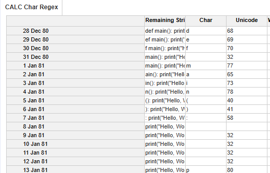
<p style="text-align: center;"> Module that will iterate over each character</p>

You can see in this image that we use the `TIME` dimension at the lower level, DAY.
Since a character = one line = one day, we will need a lot of lines to loop over each character.

The program here is a simple Python code that will print `Hello World`:
This would our example until the end of this article:
```python
def main():
    print("Hello, World!") # hi
    

if __name__ == "__main__":
    main() # hello
```

In [the documentation [python.org]](https://docs.python.org/3/reference/lexical_analysis.html#comments) a comment is a line that starts with `#` that is not inside a string.

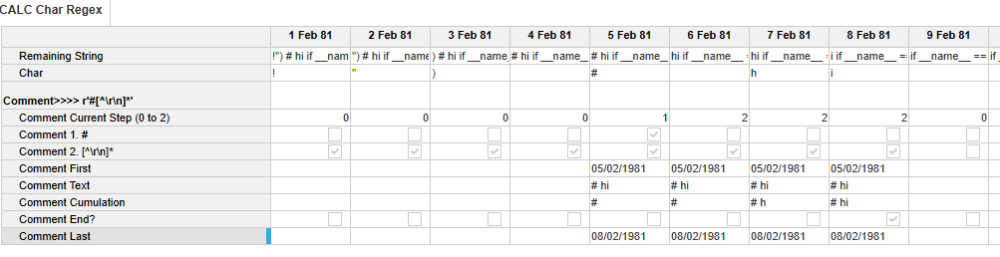
<p style="text-align: center;">Here its the part of the module that will detect the comments (the table was pivoted for readability)</p>

The logic is quite simple, we will loop over each character and check if it is a comment or not.

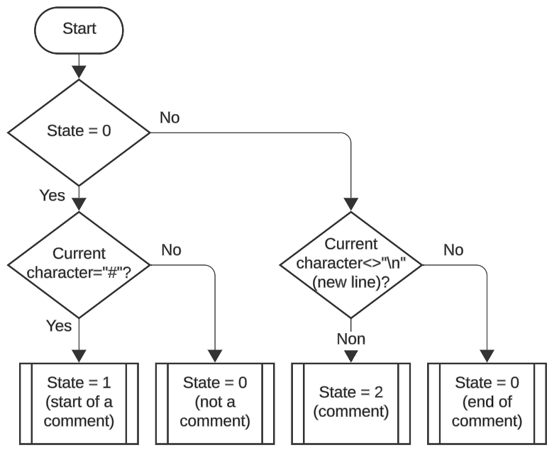
<p style="text-align: center;">Flowchart of how comment detection works</p>

Do you see the flaw?
This solution is not perfect and does not work for all the cases.
Like for this example, the second true comment is not detected:
```python
print("Hello # World") # hi
```

In the current implementation, there are few bugs like that.
Another thing I put under the carpet is case of the ["f-string" [python.org]](https://docs.python.org/3/reference/lexical_analysis.html#formatted-string-literals).
I don't have the time to implement a perfect solution, so close your eyes and hope for the best.

That was for comment detection.
For number detection, it is a bit more complicated.
I will just put the line items here.
If you need more details, please check [the documentation [python.org]](https://docs.python.org/3/reference/lexical_analysis.html#numeric-literals).

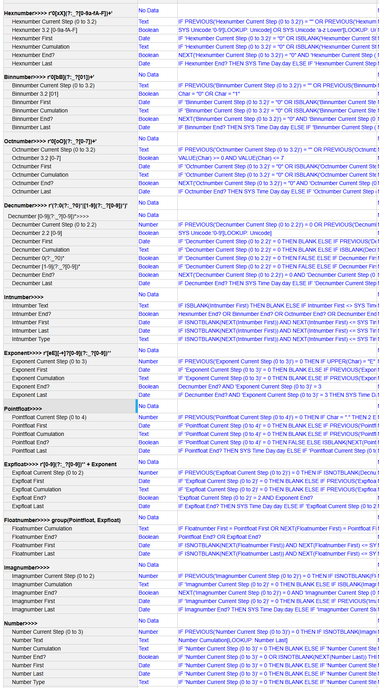
<p style="text-align: center;">Line items used to detect a number</p>

### Tokenizer Algorithm

As I said, a token is a substring that represents a single element of the code.
But in the tokenization process, we need to identify the type of token.
There are various type like:
- NAME
- NUMBER
- STRING
- NEWLINE
- INDENT
- DEDENT
- OPERATOR
- COMMENT
- ENDMARKER
- ...

This code will produce different tokens:
```python
print("Hello World")```
# Tokenization
# - NAME: print
# - OPERATOR: (
# - STRING: "Hello World"
# - OPERATOR: )
# - NEWLINE: \n
# - ENDMARKER: \0
```
than this one:
```python
print(HelloWorld)
# Tokenization
# - NAME: print
# - OPERATOR: (
# - NAME: HelloWorld
# - OPERATOR: )
# - NEWLINE: \n
# - ENDMARKER: \0
```
So the context of a word is important like for string and so an algorithm is needed to identify the type of token.

Luckily, I stumbled upon a [an already implemented algorithm [github.com/python/cpython]](https://github.com/python/cpython/blob/3.8/Lib/tokenize.py#L429).
It handles python tokenization... implemented in Python.
Unfortunately, it was only for Python 3.8 and not available in a higher version.
Probably because it was moved from a Python implementation to a C implementation for performance reasons.

Ok, now we have the algorithm.

**But how in the know world do we implement a _sequential_ algorithm in Anaplan?**

You already know the answer; we will use the TIME dimension, of course!
We simulate each step of the algorithm with a new day.

Since we loop over token, each step/day will be for a new token.
An algorithm is a state (variables) and a transition (the algorithm itself).
We try to calculate the new state of our variables from our current variables.
Here is the parte of the algorithm that handles the variables:

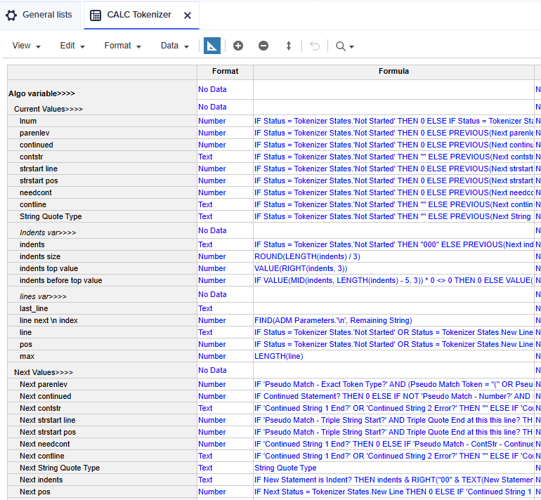
<p style="text-align: center;">Variables of the tokenizer dived in current values and next value (the future current value)</p>

Once you have the variables you need a state machine to handle the transition,
like "we are in string" so all following characters are part of the string until we reach a `"` or a `\n`.

Here is the tokenizer state I have implemented:

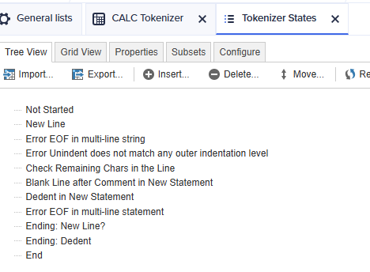
<p style="text-align: center;">All the states of the tokenizer</p>

Has you can see, we can handle _some_ basic errors in the tokenization process.

And after that you need to unroll the algorithm to handle and when you crate a new token you need to switch to the next day/state/line.

One of the interesting parts here is the indent management.
You must use a stack to handle the indent and dedent (variable `indents`).
Since there is no line item type `list`, I used a text with a fixed item size to handle the stack.
If my string length is six, I have two indents.
Nine mean I have tree indents.
And for each indent, I know how many spaces it has.
If my stack look like this:
```
000004010
```
The first 000 is the default indent (0 spaces).
The second 004 is the first indent (4 spaces).
The third 010 is the second indent (10 spaces).

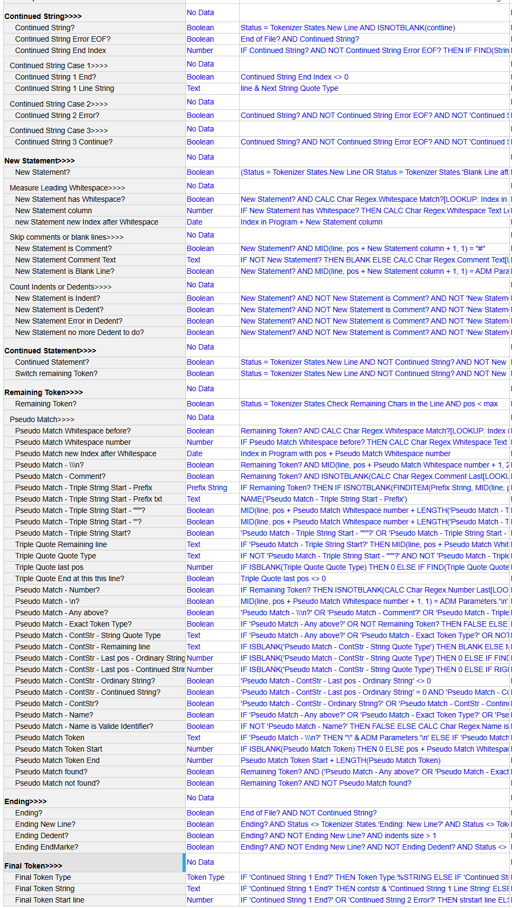
<p style="text-align: center;">The whole line items used for the "true" algorithm</p>

At the end of the day, we are able to generate this:
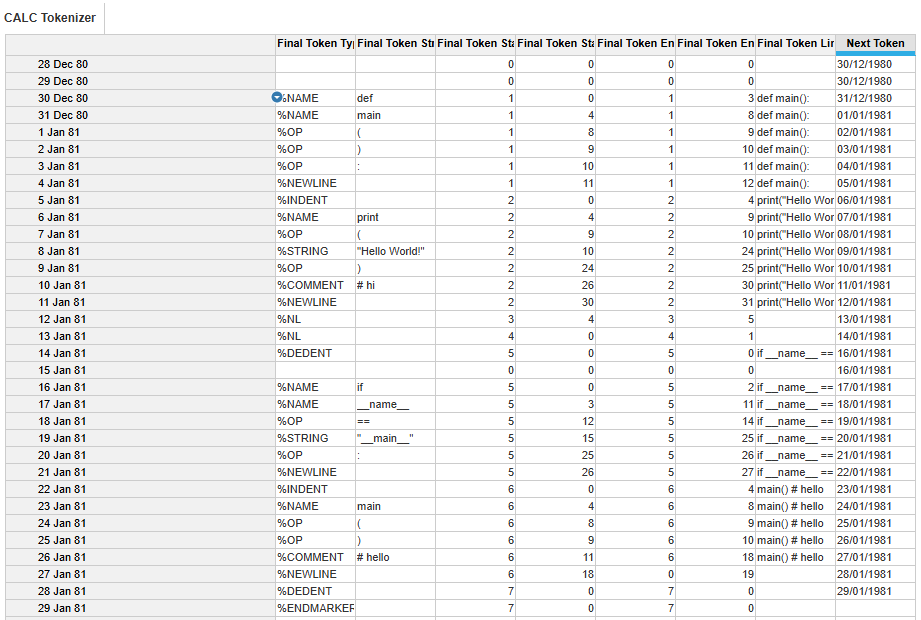
<p style="text-align: center;">All the generated tokens, line by line</p>


## Abstract Lexical Tree (AST)
Now we must put the tokens in a hierarchical structure (a tree).
The tree is a representation of the code that makes it easier to analyze and manipulate.

Here is the trickiest part.
What we did before were just the starters.

First, we need an algorithm to build the tree.
Some long researches on the internet and I found a [useful library [github.com/davidhalter/parso]](https://github.com/davidhalter/parso/tree/master) that reimplemented the transformation from tokens to ALT in Python.

Unfortunately, he used a super complex process to the job but I found a useful file: [THE GRAMMAR [github.com/davidhalter/parso]](https://github.com/davidhalter/parso/blob/master/parso/python/grammar38.txt).

A grammar is a set of rules that define how the tokens are combined to form a valid program.
It a bit like a regex but for the whole program.

Here is an extract of the grammar:
```
# ...
compound_stmt: if_stmt | while_stmt | for_stmt | try_stmt | with_stmt | funcdef | classdef | decorated | async_stmt
async_stmt: 'async' (funcdef | with_stmt | for_stmt)
if_stmt: 'if' namedexpr_test ':' suite ('elif' namedexpr_test ':' suite)* ['else' ':' suite]
while_stmt: 'while' namedexpr_test ':' suite ['else' ':' suite]
for_stmt: 'for' exprlist 'in' testlist ':' suite ['else' ':' suite]
try_stmt: ('try' ':' suite
           ((except_clause ':' suite)+
            ['else' ':' suite]
            ['finally' ':' suite] |
           'finally' ':' suite))
# ...
```

It is not super easy to read but you can understand the logic.
A `async_stmt` object must start with a token NAME `async` and then be followed by a `funcdef`, `with_stmt` or `for_stmt`.
I just discovered that we can put an `async` before a for just by reading the grammar.

### Grammar as a graph
A grammar is a bit like a directed deterministic graph with cycles.
AND and OR (`|`) are the two main operators.

For example, let's create some custom rules:
```
hello_world:        'hello' 'world'   # AND
cat_dog:            'cat' | 'dog'     # OR
multiple_hello:     'hello'*          # O or more
at_least_one_hello: 'hello'+          # 1 or more
optional_hello:     ['hello'] 'world' # optional
```
You can visualize the grammar as a graph with nodes and edges like this:
When you pass over an arrow you must consume the token.
The algorithm end when you reach the end of the graph and consume the last token.

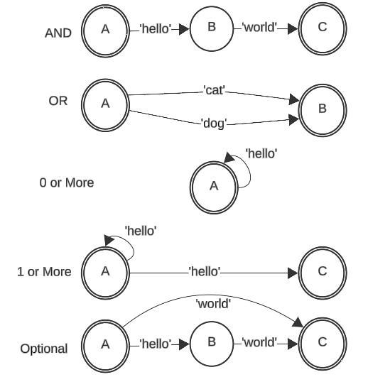
<p style="text-align: center;">Graph representation of the set of rules above</p>

You can then combine the rules to create a more complex grammar.
```python
hello_world: 'hello' world
world: 'world' ['!']
```
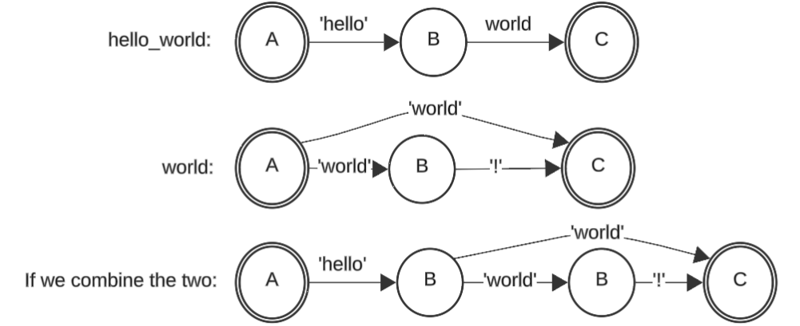
<p style="text-align: center;">Combination of the two rules</p>

### Grammar as a tree
The other way to see this grammar is as a tree.
Where rules are the primary nodes, operators are intermediate nodes and tokens/pointers are the leaves.

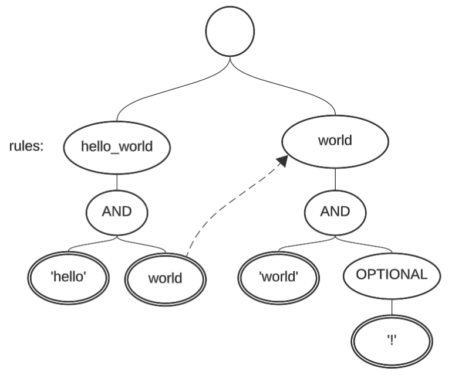
<p style="text-align: center;">Tree representation of our previous example</p>


### Algorithm to build the ALT
To create the algorithm, we either walk the graph or the tree.

For my implementation, I used the tree representation and performed a depth-first search (DFS) and try path after path and consume my tokens.

With a bit of brainstorming, here is what I came up with:

<p style="text-align: center;">The left part contains the table with each row as a step and in the right are the 3, A, B and C rules with the tree representation (if you zoom a bit) </p>

Here is the algorithm to walk through node by node (without all the details):
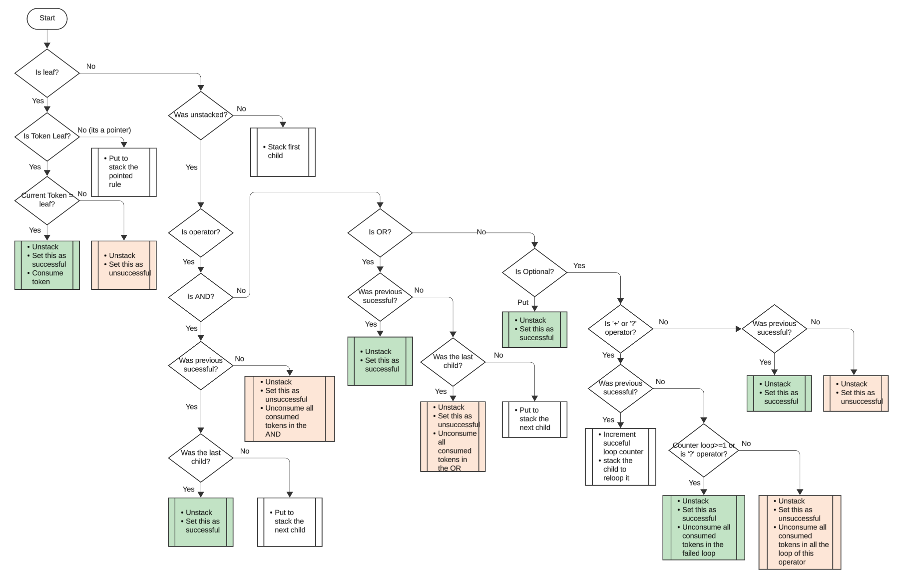

### Transform the grammar into a tree
To apply the algorithm, we need to transform the grammar into a tree representation with rules nodes, operators' nodes and token leaves.

Here again there are some work like... read the grammar, tokenize it and transform it, walk through it, and generate the tree (into a transactional format).
I partially used the algorithm in the parso library to do that and adapted it to generate the csv.
Funnily, parso used a library that generate a super complexe graph representation of the grammar (unuseful to implement it in anaplan since the generated graph is super heavy).

From a set of 95 initial rules, I ended up with 1,109 lines/nodes at the end.

| Raw Name                   | Parent Raw Name   | RawPointer  | Token Type  | Token String    | Operator  |
|----------------------------|-------------------|-------------|-------------|-----------------|-----------|
| async_stmt                 |                   |             |             |                 |           |     
| async_stmt.0               | async_stmt        |             |             |                 | 1 (AND)   |
| async_stmt.0.0 'async'     | async_stmt.0      |             |  %NAME      | async           |           |
| async_stmt.0.1             | async\_stmt.0     |             |             |                 | \| (OR)   |   
| async_stmt.0.1.0 funcdef   | async_stmt.0.1    | funcdef     | %STRING     | funcdef         |           |
| async_stmt.0.1.1 with_stmt | async_stmt.0.1    | with\_stmt  | %STRING     | with_stmt       |           |
| async_stmt.0.1.2  for_stmt | async_stmt.0.1    | for\_stmt   | %STRING     | for_stmt        |           |

Once the file is generated, we put everything in a SYS module.

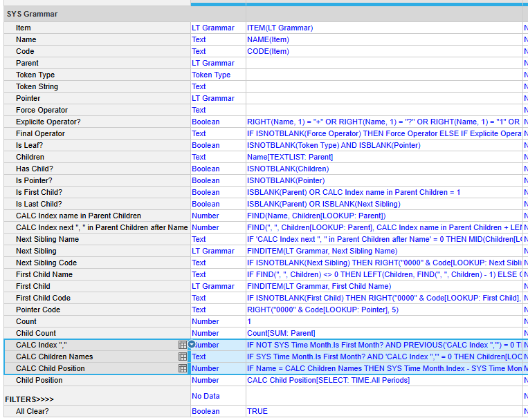
<p style="text-align: center;">The SYS module with a lot of dirty line items</p>

The 3 highlighted line items are the ones used to fetch the children of a node.
They have the time dimension so I can recursively get each child of the node.
I need it since I calculate all the children in one text line item and I need to split it.

### Implement the ALT algorithm
Here is the calc module:
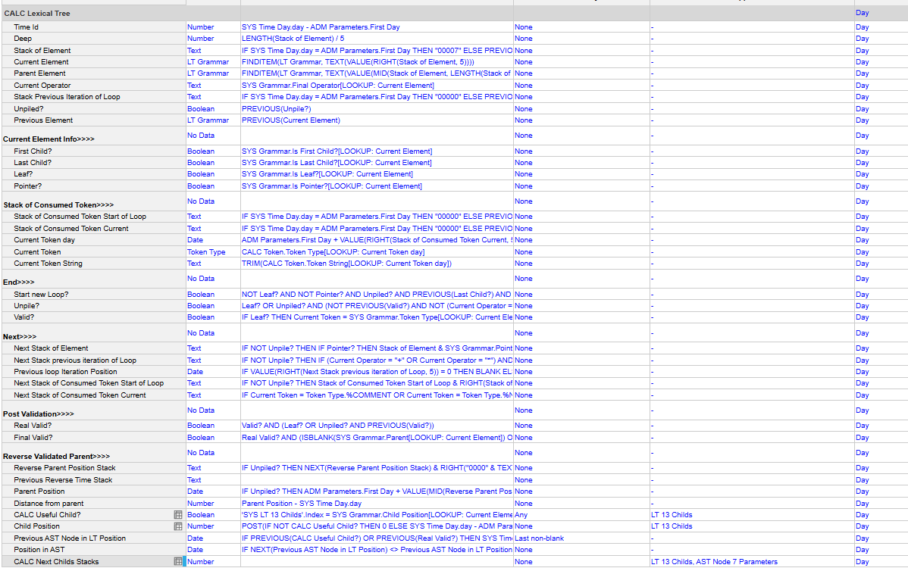

The algorithm uses multiple stacks to handle the state of the algorithm that give the ability to rollback if we are not in the right path, go over loops, etc.

And if we test it with our hello world example... we need 13 YEARS (more than 4,400 days/lines) to run the algorithm to its end.

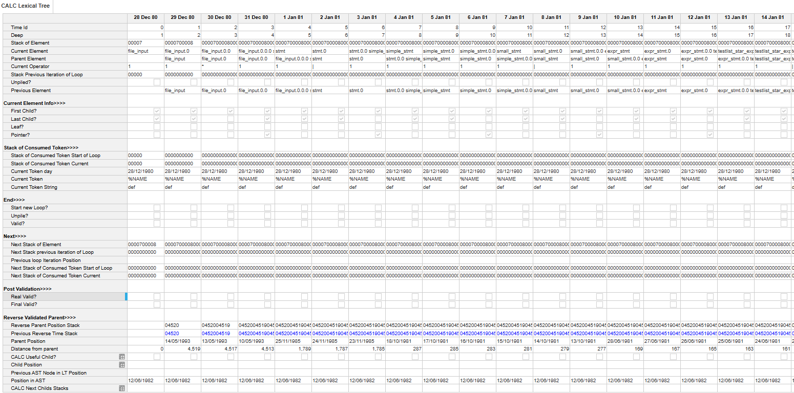
<p style="text-align: center;">What looks like the first day of the algorithm</p>

All nodes of the Grammar tree we used are not useful now (like the operators), so if we filter them out and only keep successful nodes we have 124 lines.

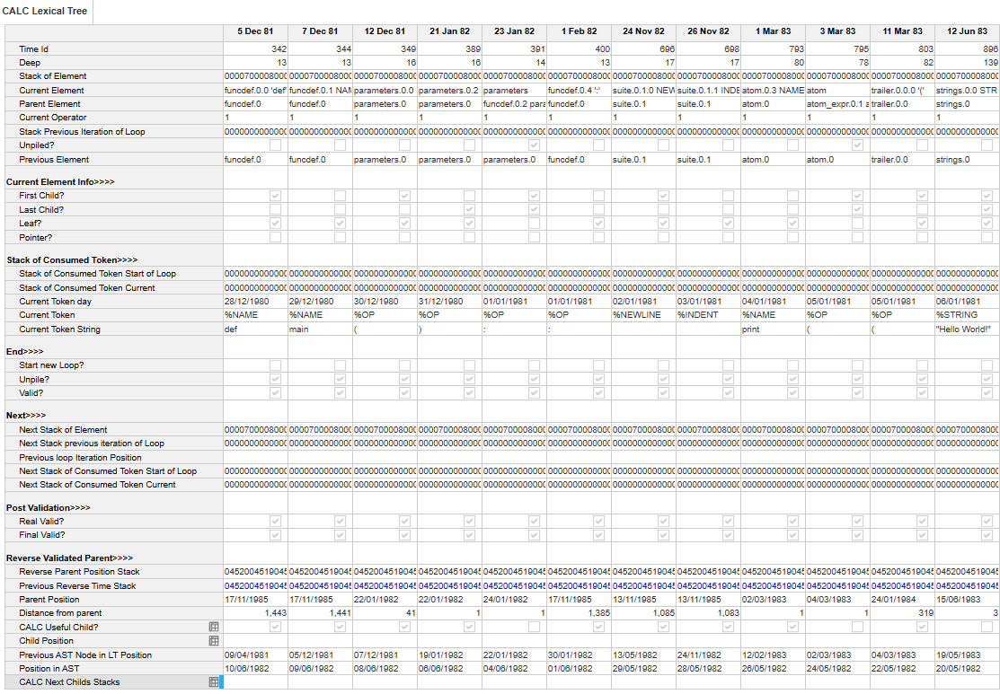
<p style="text-align: center;">Same but with only the more useful nodes</p>

At the end we have a kind of a tree that you can walk through (via the line item `Child Position`).

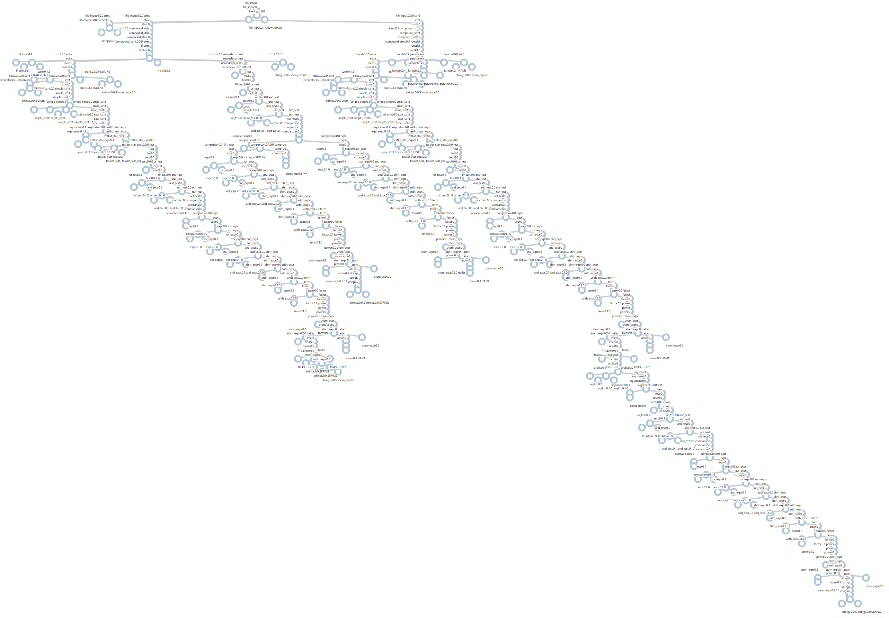
<p style="text-align: center;">What the ALT tree looks like</p>

Bravo you have successfully implemented a lexical analyzer in Anaplan!

## Abstract Syntax Tree (AST)
### Annnnnd... that all for now!!!
The next steps are not implemented yet :D